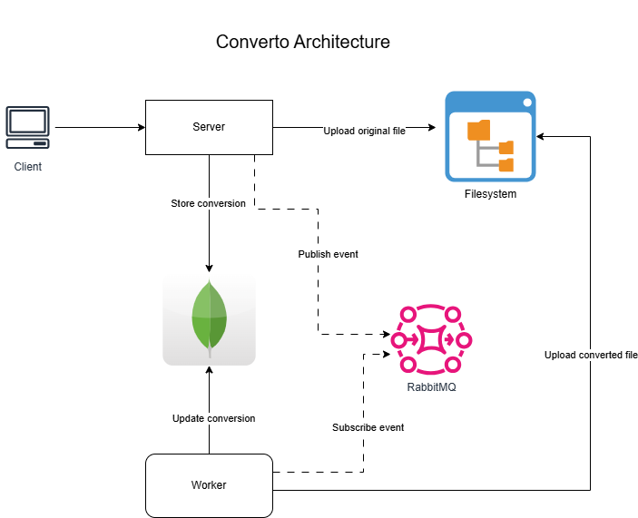
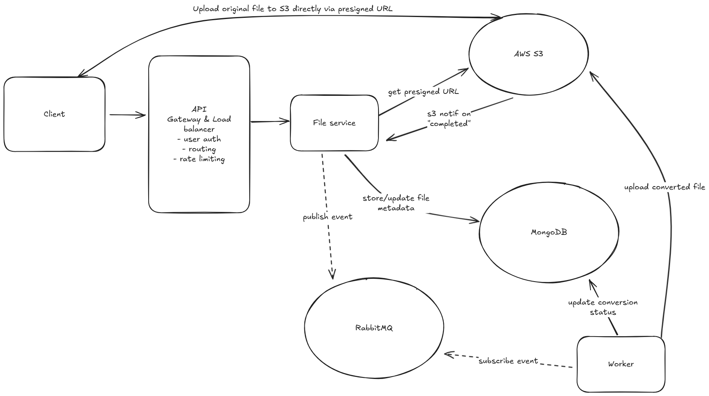

# Technical documentation

## Architecture

Here's the architecture diagram of `converto`:

### Explanation

1. **Initiating the Conversion Request**
The client sends a POST request to the endpoint `/api/v1/conversions` with the request body formatted as `multipart/form-data`. The request includes the file to be converted along with any additional conversion parameters (`target_format`).

2. **Server Handling the Request**
Upon receiving the request, the server performs the following actions:
- Store Original File: The file is saved in the filesystem to ensure efficient access during the conversion process.
- Persist Conversion Data: File metadata and conversion details (e.g., status, progress, file paths) are stored in the database. 
- Publish Conversion Event: The server publishes a `conversion_created` event to a RabbitMQ exchange, signaling that a new conversion task is ready for processing.

3. **Worker Subscription to Conversion Events**
The worker service is subscribed to the `conversion_created` event through RabbitMQ, listening specifically to messages with the designated exchange and routing key. This setup ensures that all relevant conversion events are captured and processed.

4. **Processing the Conversion Task**
When the worker receives a conversion event, it:
- Fetches Conversion Details: Retrieves the conversion record from the database to obtain necessary information such as file paths and conversion parameters.
- Simulates File Conversion: The worker copies the original file and creates a converted file in the filesystem, simulating the conversion process.
- Updates Conversion Progress: During the conversion, the worker periodically updates the conversion status and progress in the database, allowing real-time monitoring.

5. **Client Monitoring Conversion Progress**
The client can check the status and progress of a specific conversion or retrieve a list of all conversions using available API endpoints. The server will return the latest conversion state based on the data stored in the database.

## Deployment Model
This is the deployment model if we're to deploy this to the cloud service and make it production-ready:

### Explanation

Deployment Plan for 3D Model Conversion Service

- Cloud Provider: AWS

**Core Components and Deployment Strategy**

1. API Gateway & Load Balancer

- **Service**: Amazon API Gateway + AWS Application Load Balancer (ALB)

- **Purpose**:
    - User authentication (e.g., using Cognito or custom auth)
    - Routing requests to the File Service
    - Rate limiting and throttling to prevent abuse

- **Deployment**:
    - Fully managed by AWS (auto-scaling, fault tolerance)

2. File Service
- **Service**: ECS Fargate (Containerized service)

- **Purpose** :
    - Generate presigned URLs for S3 uploads
    - Store file metadata in MongoDB
    - Publish conversion events to RabbitMQ
    - Handle all API requests
- **Deployment**:
    - Scalable container service with auto-scaling rules
    - Health checks and blue/green deployments

3. Amazon S3
- **Purpose**:
    - Store original and converted 3D model files
    - Enable direct file uploads using presigned URLs
    - Trigger S3 event notifications upon successful upload

- **Configuration**:
    - Enable S3 Transfer Acceleration for faster uploads
    - Configure bucket policies and CORS for secure access
    - S3 event notification triggers File Service via SNS or SQS

4. MongoDB

- **Service**: Amazon DocumentDB (MongoDB-compatible)

- **Purpose** :

    - Store conversion metadata, file paths, and conversion statuses

- **Deployment**:
    - Multi-AZ deployment for high availability
    - Automated backups and scaling

5. RabbitMQ

- **Service**: Amazon MQ (Managed RabbitMQ)

- **Purpose**:
    - Handle event-driven communication between File Service and Worker

- **Deployment**:

    - Managed by AWS with built-in redundancy
    - Auto-healing and monitoring with CloudWatch

6. Worker Service

- **Service** : ECS Fargate

- **Purpose**:

    - Subscribe to RabbitMQ events
    - Execute 3D model conversion using the provided binary
    - Update conversion progress and status in MongoDB
    - Upload converted files to S3

- **Scaling Strategy**:
    - Use an EventBridge rule to scale worker containers based on the queue depth in RabbitMQ
    - Define resource limits and scaling policies

#### Scalability & Fault Tolerance

- Auto-scaling enabled for ECS Fargate services (File Service & Worker)
- API Gateway & ALB handle sudden traffic spikes
- S3 multipart upload supports large files and ensures resilient uploads
- RabbitMQ manages conversion tasks asynchronously to prevent overloading the worker service
- DocumentDB provides a highly available and durable storage for conversion metadata

#### Monitoring & Logging

- **AWS CloudWatch** :
    - Monitor ECS services, API Gateway, RabbitMQ, and DocumentDB
    - Set alarms and auto-remediation actions for failures

- **S3 Bucket Logs**:
    - Capture file upload/download activities

5. Security Considerations

- **IAM Roles & Policies**:
    - Principle of least privilege for all services
    - Secure access to S3, DocumentDB, and RabbitMQ

- **Data Protection**:
    - S3 server-side encryption (SSE-S3 or SSE-KMS)
    - Enable encryption at rest for DocumentDB
    - Use HTTPS for all API communications

#### CI/CD Pipeline

- **Service**: Github Actions

- **Workflow**:
    - Automated builds and tests on code commit
    - Deploy updated container images to ECS services
    - Perform blue/green deployments with health checks

7. Backup & Disaster Recovery

- **MongoDB**: Automated backups via DocumentDB

- **S3**: Versioning and cross-region replication (optional)

- **Infrastructure as Code**: Store configurations in AWS CloudFormation or Terraform to enable rapid recovery

#### Operating the Service

- Use auto-scaling policies to handle load changes
- Regularly review CloudWatch metrics and alerts
- Perform load testing and chaos engineering to validate resilience
- Establish runbooks for incident response and troubleshooting

## Future Improvements
The deployment strategy outlined above sets a solid foundation for a production-ready 3D model conversion service. However, there are several opportunities to further enhance the application's robustness, scalability, and efficiency:

1) **Current File Handling with Filesystem**
- **Reason:** For simplicity, the current implementation uses the local filesystem to store both original and converted files.
- **Opportunity:** Leverage presigned URLs from external object storage (e.g., AWS S3, GCS) for both upload and download operations. This will enhance scalability, performance, and reliability, especially for large file transfers.

2) **File Size Limitation (~1GB)**
- **Reason:** The current file upload size is constrained by the Fiber framework and was limited to simplify initial development.
- **Opportunity:** Implement client-side file chunking to support larger files. Many cloud storage services already support multi-part uploads, allowing for seamless handling of files up to several gigabytes. This change would significantly improve the app's ability to handle complex, large-scale conversions.

3) **Enhancing Service Recoverability**
- **Current State:** The app uses a circuit breaker pattern only for MongoDB connections, allowing for automatic recovery during database outages. However, RabbitMQ connections currently require manual intervention to restart both the server and worker services.
- **Opportunity:** Introduce auto-reconnection logic for RabbitMQ in both the server and worker components. The server could return a "Service Unavailable" response if RabbitMQ is unreachable, leveraging the circuit breaker pattern for graceful degradation. This will bolster fault tolerance and minimize downtime.

By implementing these enhancements, the 3D model conversion service can achieve higher levels of resilience, flexibility, and scalability—positioning it well for real-world production scenarios with high-volume conversion demands.

